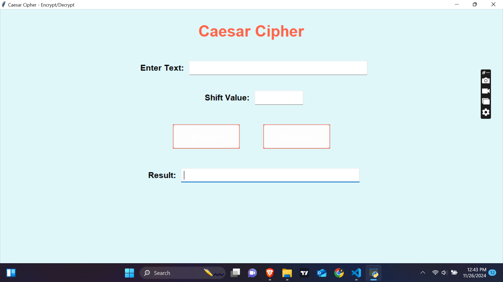
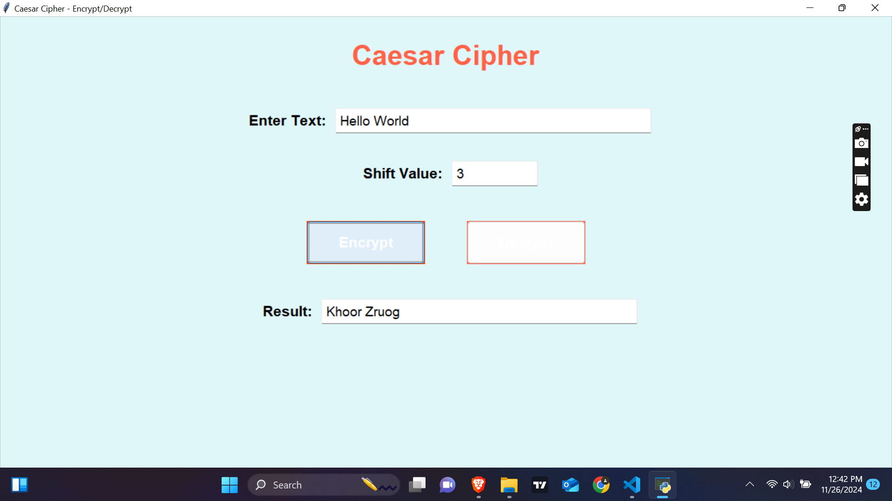
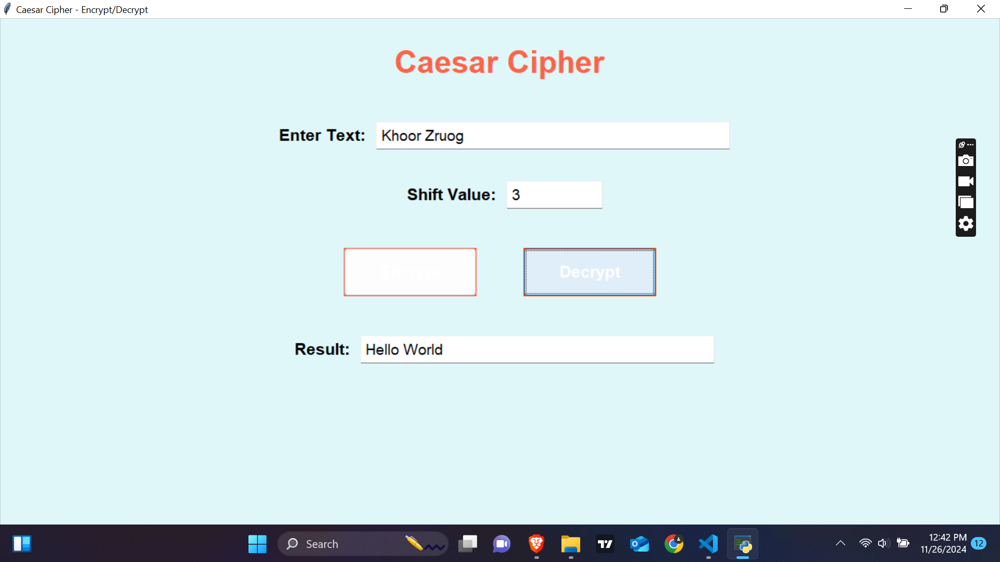

# Caesar Cipher - Encrypt/Decrypt 

# PRODIGY_CS_01 OVERVIEW
This project implements the Caesar Cipher algorithm for both encryption and decryption. The Caesar Cipher is a type of substitution cipher where each letter in the plaintext is shifted by a certain number of positions in the alphabet. Users can input a text message and a shift value to encrypt and decrypt messages.

The project provides a simple and interactive Graphical User Interface (GUI) for easy use. It allows users to input their text, shift value, and see the encrypted or decrypted result immediately.

# Features:
Encrypt Text: Encrypt the entered text by shifting each letter by the specified number of positions in the alphabet.
Decrypt Text: Decrypt the entered text by shifting each letter in the opposite direction by the specified number of positions.
Interactive GUI: A simple, user-friendly interface built with Python's Tkinter library.

# Technologies Used:
Python 3.x
Tkinter (for GUI)
Caesar Cipher Algorithm

# Requirements:
To run this project, ensure you have the following installed on your system:
Python 3.x (Recommended: Python 3.6 or later)
Tkinter (Comes pre-installed with Python, no need for separate installation)

# How to Run:
1. Clone the Repository:
Clone this repository to your local machine using the following command:
git clone https://github.com/telegeii/PRODIGY_CS_01.git

2. Navigate to the Project Folder:
cd PRODIGY_CS_01

3. Run the GUI:
Make sure Python is installed on your system, and run the gui.py file to launch the GUI:
**python gui.py**

4. Using the Program:
Input Message: Enter the text you want to encrypt or decrypt in the "Enter Text" field.
Shift Value: Specify the number of positions to shift each character in the "Shift Value" field.
Encrypt Button: Click the "Encrypt" button to encrypt the text.
Decrypt Button: Click the "Decrypt" button to decrypt the text.

# Code Breakdown:
1. Caesar Cipher Algorithm:
The core of this project is the Caesar Cipher algorithm, which works by shifting each character in the text by a fixed number of positions. Here's how it works:
For encryption, the shift value is added to the Unicode value of each letter in the text.
For decryption, the shift value is subtracted from the Unicode value of each letter in the encrypted text.

2. Functions:
encrypt(text, shift):
Encrypts the provided text using the specified shift value.
It checks if each character is an alphabet letter and shifts it accordingly. Non-alphabet characters are left unchanged.
decrypt(text, shift):

Decrypts the provided text using the specified shift value.
Similar to the encryption function, it shifts each letter in the opposite direction to retrieve the original message.

3. GUI Structure:
The GUI is created using Tkinter. Here’s an overview of how the interface is structured:

Text Input Field: A field where users can enter the text they want to encrypt or decrypt.
Shift Value Field: A field where users input the number of positions to shift the characters.
Encrypt Button: When clicked, it encrypts the text.
Decrypt Button: When clicked, it decrypts the text and shows the result.
Result Field: Displays the encrypted or decrypted result.

4. Button Design and Interactivity:
The buttons are styled to make them visually appealing, with hover effects and larger text to improve usability. The encryption and decryption buttons are large and bright to catch the user's attention.

Screenshots
Below are some screenshots showing how the application works:
### Main Interface

### Encrypting Text Interface

### Decrypting Text Interface

